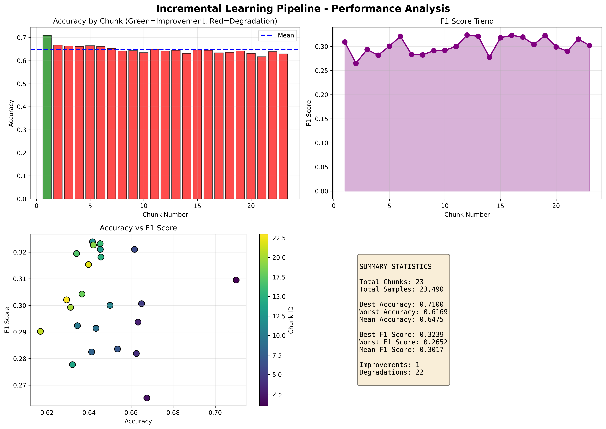

# Manufacturing Defect Detection - MLOps Project

**Status**: Active  
**Model Version**: v1  
**Best Accuracy**: 0.7100  
**Last Updated**: 2025-12-27 15:56:32

## 📊 Project Overview

This is an **MLOps production-ready project** implementing an **Incremental Learning Pipeline** for manufacturing defect detection. The system automatically trains multiple models with expanding datasets, evaluates performance, and deploys the best performing model to production.

## 🎯 Best Model Performance

### Model Information
- **Model ID**: Model_01
- **Training Samples**: 1,000
- **Training Data Chunks**: 1/23
- **Deployment Status**: Production Ready

### Key Metrics

| Metric | Value |
|--------|-------|
| **Accuracy** | 0.7100 |
| **F1-Score** | 0.3095 |
| **Precision** | 0.2708 |
| **Recall** | 0.3611 |

## 📈 Incremental Learning Pipeline

### Pipeline Configuration
- **Total Chunks Trained**: 23
- **Samples per Chunk**: 1,000
- **Total Training Samples**: 23,490

### Performance Summary

| Metric | Value |
|--------|-------|
| Best Accuracy | 0.7100 |
| Worst Accuracy | 0.6169 |
| Mean Accuracy | 0.6475 |
| Best F1-Score | 0.3239 |
| Mean F1-Score | 0.3017 |
| Improvements | 1 |
| Local-Only Models | 22 |

### Learning Curve



## 🏗️ Architecture

### Project Structure
```
mlops_defect_project/
├── src/
│   ├── training/
│   │   ├── train.py                 # Base training module
│   │   └── incremental_train.py      # Incremental learning pipeline
│   ├── registry/
│   │   ├── promote.py               # Model promotion script
│   │   └── evaluate_incremental.py  # Model evaluation
│   ├── features/
│   │   └── hashed_features.py       # Feature engineering
│   ├── serving/
│   │   └── app.py                   # FastAPI serving
│   └── config.py                    # Configuration
├── artifacts/
│   ├── incremental_models/          # All trained models
│   ├── checkpoints/                 # Model checkpoints
│   └── reports/                     # Training reports
├── data/
│   └── numeric_data.csv             # Training data
├── .gitlab-ci.yml                   # GitLab CI/CD
├── Jenkinsfile                      # Jenkins CI/CD
├── .circleci/config.yml            # CircleCI config
└── requirements.txt                 # Dependencies
```

## 🚀 CI/CD Pipelines

This project includes three enterprise-grade CI/CD implementations:

### 1️⃣ **GitLab CI/CD** (.gitlab-ci.yml)
- **Stages**: Build → Test → Train → Evaluate → Deploy
- **Key Features**:
  - Automated dependency installation
  - Python syntax validation
  - Unit and integration testing
  - Incremental model training
  - Automatic model comparison
  - GitHub push on success

### 2️⃣ **Jenkins** (Jenkinsfile)
- **Pipelines**: Declarative pipeline with multiple stages
- **Key Features**:
  - Build environment setup with venv
  - Comprehensive test suite
  - Incremental learning with timeout handling
  - Artifact archiving
  - GitHub integration
  - Clean workspace management

### 3️⃣ **CircleCI** (.circleci/config.yml)
- **Workflows**: Multi-job orchestration with caching
- **Key Features**:
  - Dependency caching for faster builds
  - Parallel job execution
  - Workspace persistence
  - Large resource class for training
  - GitHub push with commit messages

### Pipeline Stages

#### 1. **Commit Stage** ✓
- Code checkout and syntax validation
- Dependency management
- Import checks
- Quality gates

#### 2. **Test Stage** ✓
- Unit tests execution
- Feature engineering validation
- Test coverage reporting

#### 3. **Training Stage** 🚀
- Splits CSV into 1000-sample chunks
- Trains 23 models incrementally
- Each model adds new data to previous
- Compares accuracy with previous model
- Saves models and metadata

#### 4. **Acceptance Test Stage** ✅
- Validates model quality (min 0.70 accuracy)
- Checks acceptance criteria
- Generates evaluation reports

#### 5. **Deploy Stage** 📤
- Promotes best model to production
- Updates README with results
- Commits and pushes to GitHub
- Only runs on main branch

## 📊 Model Training Details

### Incremental Learning Strategy

**Data Split**: CSV with 23,490 rows → 23 chunks of 1,000 rows each

**Training Process**:
```
Chunk 1:    Train Model 1 with 1,000 samples (Accuracy: baseline)
Chunk 2:    Train Model 2 with 2,000 samples (Compare with Model 1)
Chunk 3:    Train Model 3 with 3,000 samples (Compare with Model 2)
...
Chunk 23:   Train Model 23 with 23,000 samples (Final best model)
```

**Promotion Logic**:
- ✅ **IF** accuracy ≥ previous → Push to production
- ❌ **ELSE** → Store locally only (no push)

### Feature Engineering

- **Numeric Features**: StandardScaler normalization
- **Categorical Features**: Hashed embeddings (4096 dimensions)
- **Target**: DefectStatus (binary classification)
- **Imbalance Handling**: SMOTE resampling

### Model Ensemble

Voting Classifier combining:
- **Logistic Regression** (linear patterns)
- **Random Forest** (non-linear patterns, 250 trees)
- **Gradient Boosting** (adaptive learning)

## 🛠️ Setup & Installation

### Prerequisites
- Python 3.11+
- Git
- Docker (optional)

### Installation

```bash
# Clone repository
git clone https://github.com/atknylmz/MLOPS_PROJECT.git
cd MLOPS_PROJECT

# Create virtual environment
python -m venv venv
source venv/bin/activate  # On Windows: venv\Scripts\activate

# Install dependencies
pip install -r requirements.txt

# Install development dependencies
pip install pytest pytest-cov black pylint
```

### Running Training Locally

```bash
# Run incremental training pipeline
python -m src.training.incremental_train

# Evaluate models
python src/registry/evaluate_incremental.py

# Promote best model
python src/registry/promote.py
```

## 📝 Configuration

Edit `src/config.py` to customize:

```python
hash_buckets: int = 2**12        # Feature hashing dimensions
target_col: str = "DefectStatus" # Target variable
categorical_cols: tuple[str, ...]  # Categorical features
```

## 🔗 API Serving

FastAPI server for model serving:

```bash
# Start API server
python -m src.serving.app

# API will be available at http://localhost:8000
# Swagger docs: http://localhost:8000/docs
```

## 📦 Deployment

### Docker

```bash
docker build -t mlops-defect-model .
docker run -p 8000:8000 mlops-defect-model
```

### Cloud Platforms

- **AWS**: SageMaker, Lambda, EC2
- **Google Cloud**: Vertex AI, Cloud Run
- **Azure**: ML Studio, Container Instances

## 📊 Monitoring & MLflow

All models are tracked in MLflow:

```bash
# Start MLflow UI
mlflow ui

# View all experiments at http://localhost:5000
```

## 🔄 Continuous Integration

### GitLab CI
```bash
git push origin main  # Automatically triggers pipeline
```

### Jenkins
- Configure GitHub webhook in Jenkins
- Set up Jenkins job from Jenkinsfile
- Auto-triggers on commit to main

### CircleCI
- Connect GitHub repo to CircleCI
- Auto-triggers on commit
- View progress at circleci.com

## 📊 Results & Artifacts

All results are stored in `artifacts/`:

```
artifacts/
├── incremental_models/
│   ├── model_01/
│   │   ├── model_chunk_01.joblib
│   │   └── metadata.json
│   ├── model_02/
│   │   ├── model_chunk_02.joblib
│   │   └── metadata.json
│   ...
│   └── model_23/
│       ├── model_chunk_23.joblib
│       └── metadata.json
│
├── checkpoints/
│   ├── model_*.joblib
│   └── acceptance_*.json
│
└── reports/
    ├── incremental_training_report.json
    ├── model_evaluation.json
    └── incremental_learning_visualization.png
```

## 🎓 Learning Resources

- [MLflow Documentation](https://mlflow.org)
- [Scikit-learn Ensemble Methods](https://scikit-learn.org/stable/modules/ensemble.html)
- [GitLab CI/CD](https://docs.gitlab.com/ee/ci/)
- [Jenkins Documentation](https://www.jenkins.io/doc/)
- [CircleCI Documentation](https://circleci.com/docs/)

## 🤝 Contributing

1. Create feature branch: `git checkout -b feature/improvement`
2. Make changes and test locally
3. Commit: `git commit -m "feat: description"`
4. Push: `git push origin feature/improvement`
5. Create Pull Request

## 📄 License

MIT License - See LICENSE file for details

## 👤 Author

**MLOps Team**  
- GitHub: [@atknylmz](https://github.com/atknylmz)
- Email: atknylmz@email.com

## 📞 Support

For issues and questions:
- Open GitHub Issues
- Contact: atknylmz@email.com
- Documentation: See `/docs` folder

---

**Last Updated**: 2025-12-27 15:56:32  
**Best Model Accuracy**: 0.7100  
**Total Models Trained**: 23  
**Project Status**: ✅ Active & Maintained
